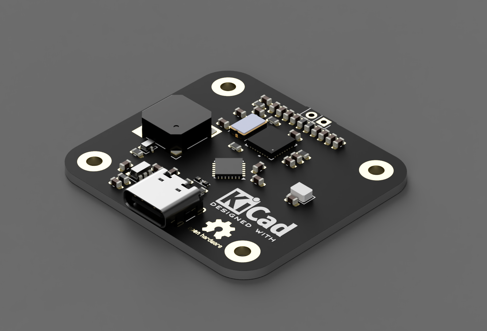

# STM32G0 + MFRC522 RFID Reader
<p align="center">
  
</p>
This repository provides code and hardware documentation for interfacing the **MFRC522 RFID reader** with an **STM32G0 series microcontroller** over SPI. The firmware initializes the MFRC522, detects RFID cards, and prints their UID over UART. It also includes support for an **addressable RGB LED** (e.g., WS2812B) and a **buzzer** for feedback.

##  Features
- Uses STM32Cube HAL for SPI, GPIO, and TIM
- Reads MIFARE cards (UID output)
- Controls an addressable RGB LED (PA3)
- Activates buzzer on card detection (PA2)
- Compatible with MFRC522 13.56 MHz modules
- Designed for STM32G0xx (e.g., STM32G071, STM32G031)
- Antenna is tuned for best theoretical range (10–15 cm)

>  **Note:** Higher read ranges (>15 cm) are only possible with UHF RFID chipsets (e.g., EPC Gen2, ISO18000-6C), which are significantly more expensive. This project limits itself to a 13.56 MHz MFRC522-based design due to a target **cost constraint of ₹500**, making UHF solutions out of scope.

---

##  Repository Structure
```
├── Core
│   ├── Inc
│   │   └── mfrc522.h           # MFRC522 header file
│   └── Src
│       └── mfrc522.c           # MFRC522 implementation
├── Drivers
│   └── STM32G0xx_HAL_Driver    # HAL drivers
├── README.md                   # This file
├── main.c                      # Main application logic
├── LICENSE                     # GNU GPL v3 license
└── .ioc                        # STM32CubeMX project file
```

---

##  Hardware Connections
### SPI Interface
| MFRC522 Pin | STM32G0 Pin | Description |
|-------------|-------------|-------------|
| SDA (SS)    | PA4         | SPI Chip Select |
| SCK         | PA5         | SPI Clock |
| MOSI        | PA7         | SPI MOSI |
| MISO        | PA6         | SPI MISO |
| RST         | PB0         | Reset Pin |
| 3.3V        | 3.3V        | Power |
| GND         | GND         | Ground |

### Other IOs
| Component         | STM32G0 Pin | Notes                       |
|-------------------|-------------|-----------------------------|
| Buzzer            | PA2         | On for tag detected         |
| RGB LED (WS2812B) | PA3         | 1-wire protocol             |

---

##  Example Output (USB)
```
MFRC522 Reader Initialized
Scan RFID...
UID: DE AD BE EF
```

---

##  Getting Started

### Prerequisites
- STM32CubeIDE or STM32CubeMX
- ST-LINK or compatible debugger
- MFRC522 RFID Module
- WS2812B LED
- Buzzer (active or transistor-driven passive)

### Build & Flash
1. Clone this repo: `https://github.com/Vishal01Mehra/OTG_RFID`
2. Open the `.ioc` file in STM32CubeIDE
3. Generate code and build
4. Flash to STM32G0 MCU

### Dependencies
- STM32 HAL Drivers (auto-imported with `.ioc`)

> 🔧 **Note:** Software is coming soon. Code files will be released as part of the first firmware version.

---

##  References
- [MFRC522 Datasheet](https://www.nxp.com/docs/en/data-sheet/MFRC522.pdf)
- [STM32G0 Reference Manual](https://www.st.com/resource/en/reference_manual/dm00371828.pdf)
- [WS2812B Timing](https://cdn-shop.adafruit.com/datasheets/WS2812B.pdf)

---

##  License
This project is licensed under the **GNU General Public License v3.0** - see the [LICENSE](LICENSE) file for details.

---

## Author
**Vishal Mehra** - Mehra Autonomous Systems Pvt. Ltd.

---

Feel free to contribute or raise issues via GitHub.